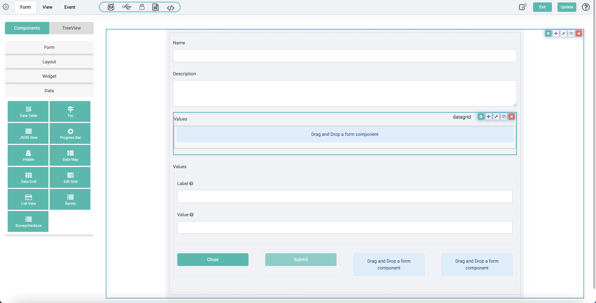
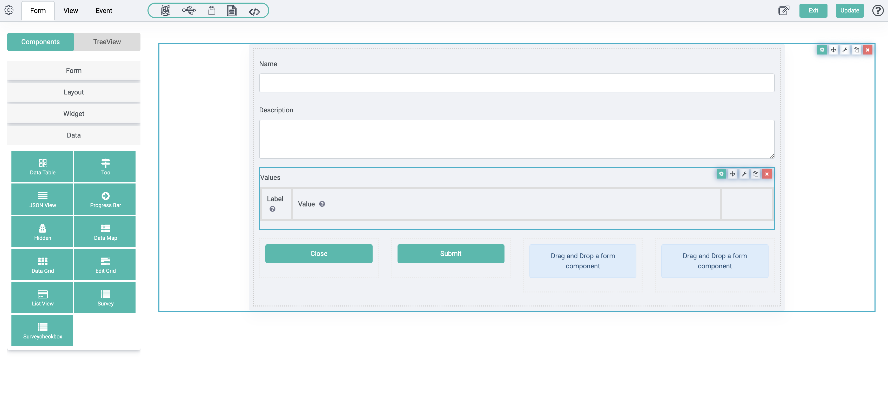
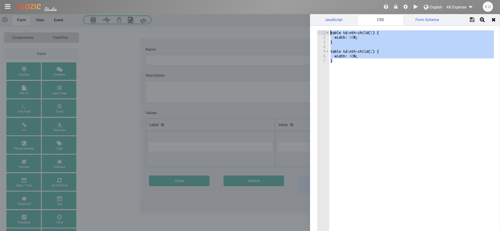

# Data Grid Component

In the previous tutorial, we have created the **settings** collection for saving list of lookup values. The **settings** form that we have built was using an **Edit Grid** component, it saves the list of values as subdocuments of the **Settings** document.

We are going to replace the Edit Grid component with a **Date Grid** component in this tutorial.

## Add a Data Grid

Open the **settings** form designer. Add a **Data Grid** component to either above or below the **Edit Grid** component. This is shown in the below screen capture.



:::tip Note
When adding the **Data Grid** and named it as **values** the API field name will be defaulted as **values1** as there is already a component (i.e. Edit Grid) with the same name as **values**, ignore it for now as we going to change the name to **values** after we moved all the fields from Edit Grid to Data Grid, and after deleted the Edit Grid
:::

## Migrate all fields from Edit Grid

Drag the `Label` and `Value` components from the **Edit Grid** to the newly added **Data Grid** component. Once done, delete the empty **Edit Grid** component, and rembmered to rename the API name of the **Data Grid** to `values`. Once done, you should be getting something similar to below screen capture.


## Style the Data Grid

One of the common styling for Data Grid that is often required is setting the column width. To do so, open the Code editor from the **Toolset Icons**, add the following CSS to set the column width for the Data Grid.

```CSS
table td:nth-child(1) {
  width: 40%;
}

table td:nth-child(2) {
  width: 40%;
}
```

This is shown in the below screen capture.
