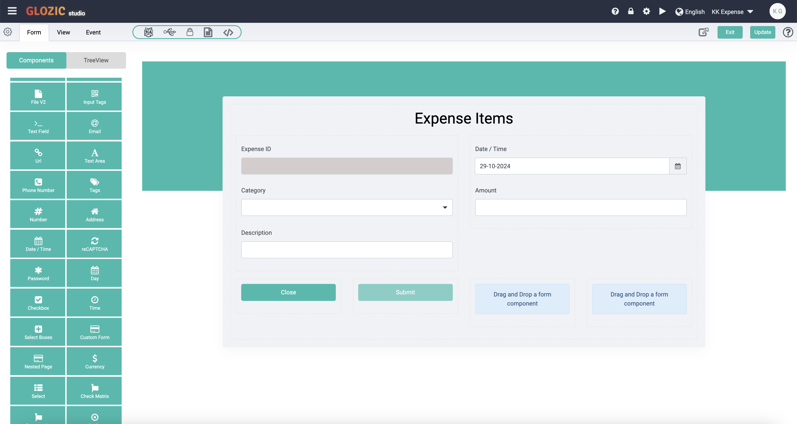
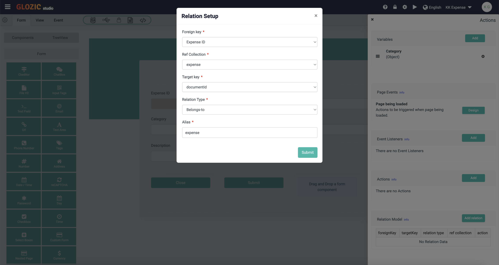
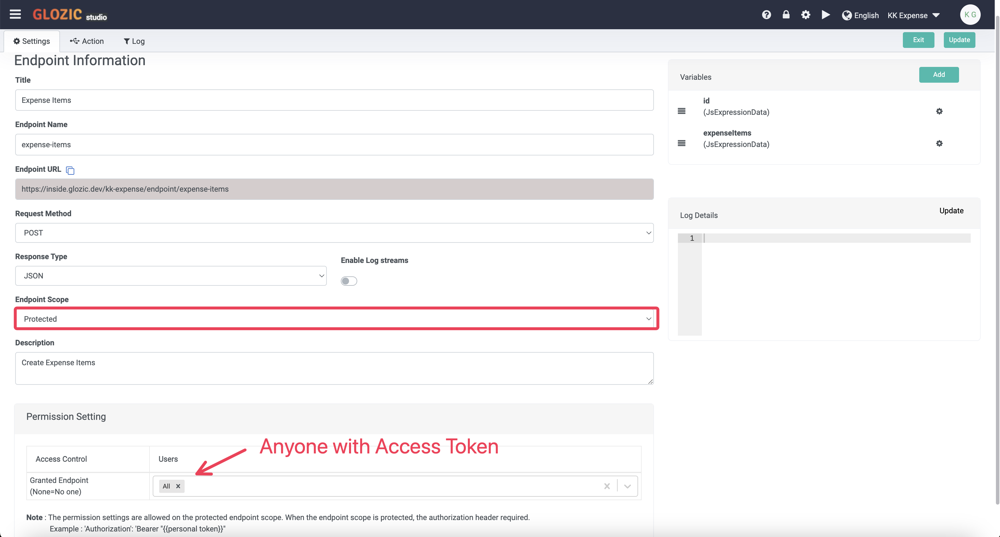
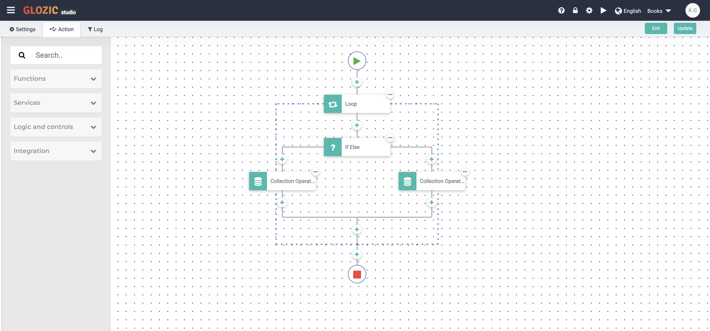
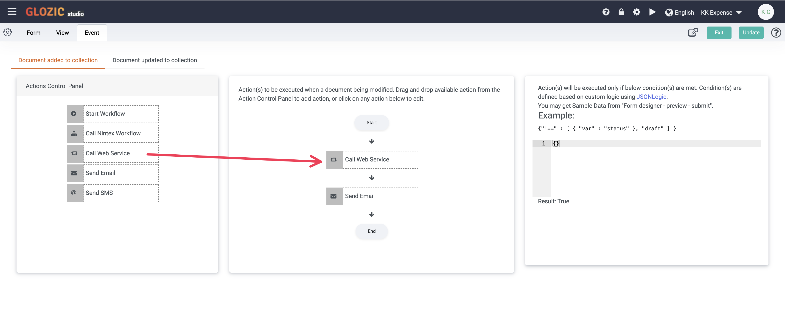
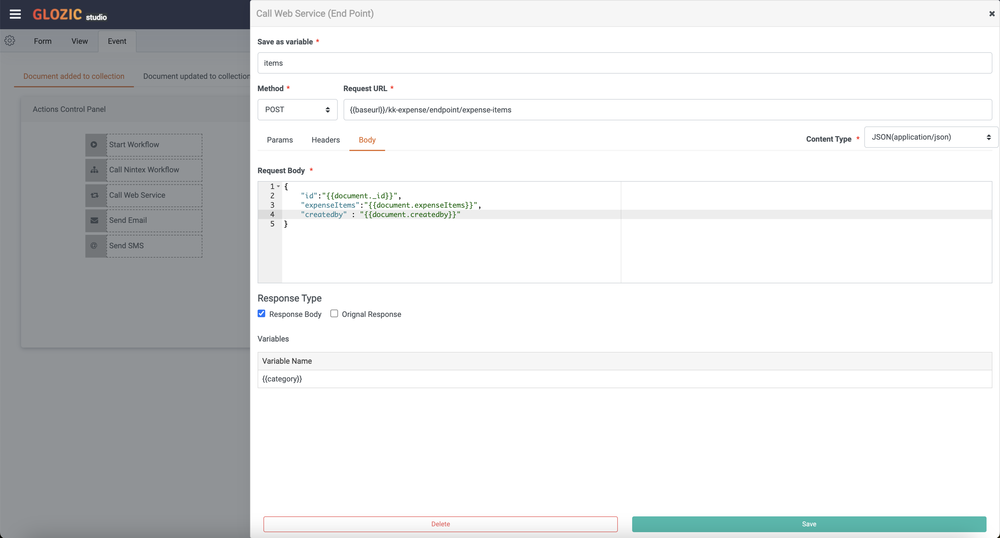
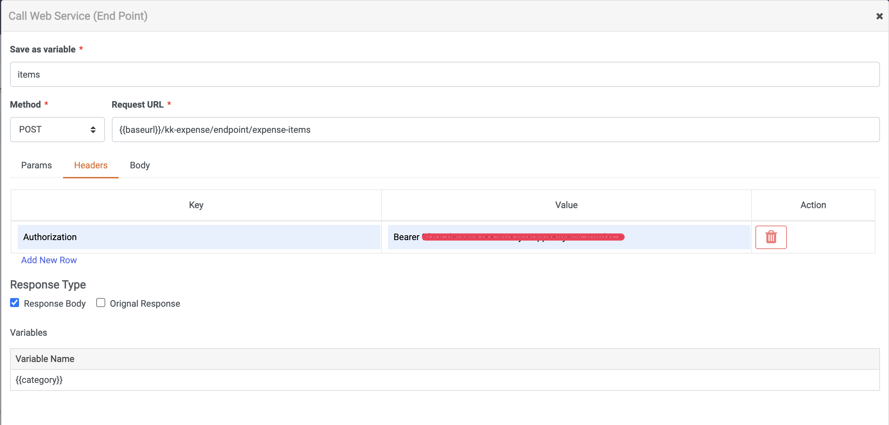
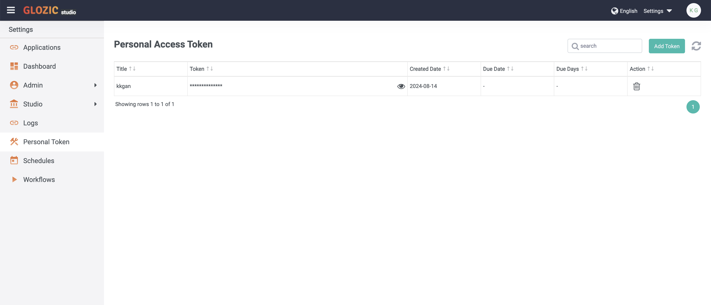
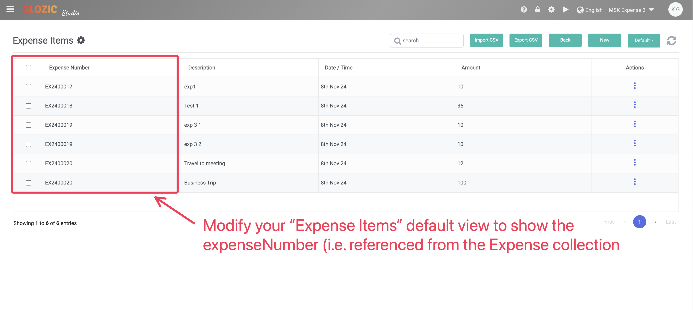

# Modeling Relationships

**Modeling Relationships in Glozic**

Glozic offers two primary techniques to model relationships between data:

1. Embedding:

- Subdocuments are directly embedded within a parent document. This approach is ideal for closely related data that is frequently accessed together.
- When you add components like DataGrid or EditGrid to a form, their data is typically stored as embedded subdocuments within the parent document.

2. Referencing:

- A reference (e.g., object ID) to a related document is stored. This is suitable for less tightly coupled relationships where child documents can be accessed independently.

In this tutorial, we will explore how to create a separate collection for subdocuments and establish a has-many relationship between the parent and child collections. This approach provides more flexibility and scalability, especially for large datasets or complex relationships.

## Create a Expense Items collection

Create a new collection for **Expense Items** with below information

| Field | Value |
|--|--|
| Title | Expense Items |
| Name | expense-items |
| Description | Expense Items |

Creat the Expense Items form with the following form components

- Edge Frame (Layout) [img](./img/3-model-expense-edgeframe.png)
  - Typography ( Form `Expense Item`)
  - 6-6 Columns (Layout - Columns)
    - Expense ID (Form - Text Field `hidden` `disabled`)
    - Category (Form - Select)
    - Date (Form - Date/Time)
    - Description (Form - Text Field)
    - Amount (Form - Currency)
  - 3-3-6 Columns (Layout - Columns)
    - Close Button (Form - Custom Button)
    - Submit Button (Form - Submit Button)

The form should look similar to below screen capture


## Create Belongs-to relationship in Expense Items

Select the **Connector** icon from the Form Toolset Icons, click **Add relation** to setup a new model relation. Refer to the below screen capture for proposed values:


Update and Exit from the **Expense Items** collection design.

## Force saving Expense Items to Expense Items collection

### Create Expense Items Endpoint
Create an **Expense Items** endpoint for POSTing of Expense Items to the Expense Items collection. Refer to the table below for proposed values

| Field | Value |
|--|--|
| Title | Expense Items |
| Name | expense-items |
| Endpoint URL | `https://<tenant>.glozic.dev/<app-name>/endpoint/expense-items` |
| Method | POST |
| Response Type | JSON |
| Endpoint Scope | Protected |
| Description | Create Expense Items |

Add the following Variables to the endpoint
| Variable | Type | Code |
|--|--|--|
| id | JS Expression | `return(_var.request.body.id)` |
| expenseItems | JS Expression | `return(_var.request.body.expenseItems)` |

Below screen capture shows an example of the Endpoint settings


Create the following flow


**Loop**
| Field | Value |
|--|--|
| Source Type | Variable |
| Variable List | expenseItems |
| Save response to varialbe | item |

**If Else**
| Field | Value |
|--|--|
| Source Type | Variable |
| When | `{{item._id}}` |
| Operator | is not empty |
| Save response to varialbe | exists |

**Collection Operation** (False / Left-branch)
| Field | Value |
|--|--|
| Method | Create |
| Insert Type | Insert One |
| App | `<App Name>` |
| Collection | expense-items |
 Submission Body
 ```JSON
{
  "category": "{{item.category}}",
  "dateTime": "{{dateTime}}",
  "description": "{{item.description}}",
  "amount": "{{item.amount}}",
  "expenseId": "{{id}}"
}
```

**Collection Operation** (True / Right-branch)
| Field | Value |
|--|--|
| Method | Update |
| App | `<App Name>` |
| Collection | expense-items |
| Fetch Record | documentId, `{{item._id}}`|
 Submission Body
 ```JSON
{
  "category": "{{item.category}}",
  "dateTime": "{{dateTime}}",
  "description": "{{item.description}}",
  "amount": "{{item.amount}}",
  "expenseId": "{{id}}"
}
```


### Save Expense Items to the child collection
Design the **Expense** collection, go to the **Event** tab to design the **Document added to collection** event by drag and drop a **Call Web Service** action onto the flow designer.


Enter suggested values as shown in the below screen capture


Since the **Expense-Items** endpoint is a protected endpoint, we will need to add the **Authorization** header with the following key-value pair as shown in the below screen capture


:::tip Note
See the following section on how to get an Access Token
:::

### Create Access Token for the restricted endpoint

To generate a personal token for API, go to the `settings` menu from the Application Dropdown of Studio. Select **Personal Token** from the SideNav, you should be brought to Personal Access Token console as shown in the below screen capture.


Click **Add Token** to create a new token, give the personal access token a name and select a validaty duration for the token. You may copy the created token to be used call calling restricted Endpoints created on the Glozic Platform.

## Display referenced document property in view

With the Model Relation, the view will auto reference the related document. We're going to modify the Default view of Expense Items to show it's parent document's **Expense Number**. This is shown in the below screen capture.
