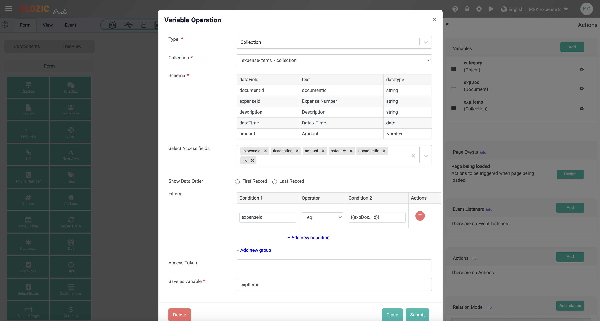
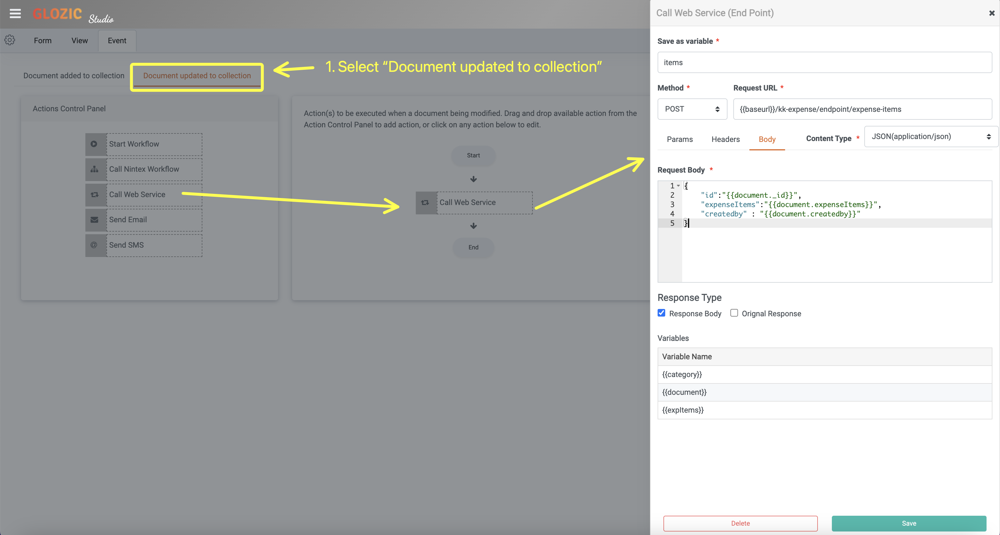

# Update Subdocuments

In the previous tutorial, we have forced to save **Expense Items** to a separated collection, and set the **Expense Items** collection with relation stated it belongs-to the **Expense** collection. This allowed auto referencing of **Expense** object for each **Expense Items**.

In the **Expense** documents, as it saves the **Expense Items** as subdocuments, in the event if we are updating the Expense Items, we would like to also update the related **Expense Items** collection.

**Querying Expense Items in Expense Document**

Define a **expItems** variable in the **Expense** document, to get the list of Expense Items with expenseID equals to the current Expense document.

Add the following variables to the Expense collection design.
| Field | Value |
|--|--|
| Type | Document |
| Save as variable | document |

| Field | Value |
|--|--|
| Type | Collection |
| Collection | `expense-items - collection` |
| Select Access Fields | `category`, `amount`, `description`, `expenseId`, `documentId`, `_id` |
| Filters | `expenseId` eq `{{document._id}}` |
| Save as variable | expItems |

Below screen capture shows how the `expItems` is being configured.


**Replace the `expenseItems` Edit Grid values**

Open the Code editor of the **Expense** collection form, enter the following code to replace the `expenseItems` component
```Javascript
$(document).ready(function(){
  const expenseItems = form.expItems;
  const value = formio.getValue();
  value["data"]["expenseItems"] = expenseItems;
  formio.setValue(value)
})
```

Below screen capture for reference


**Call the Endpoint when Expense being updated**

Next, you will need to call the same endpoint in the previous tutorial to update the **Expense Items** collection with the Expense Items. Below screen capture shows how the "Document updated to collection" Event is being configured.
