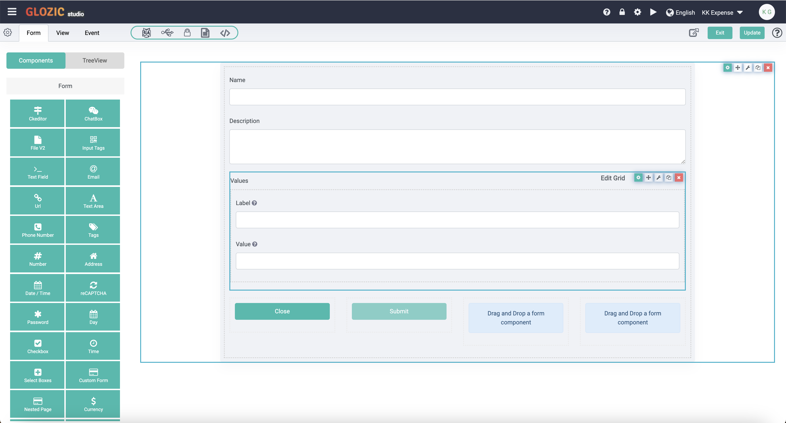

# Form Components and Variables

**Expanding Your Collection Design Skills.**

Building upon your foundational knowledge from the Basic Tutorial, we'll dive deeper into advanced Collection concepts. Discover how to leverage more sophisticated form components, master data querying with variables, and effectively utilize those variables within your forms. This tutorial will also guide you through creating intricate entity-relationship form models, empowering you to design robust and interconnected collections.

## Create a "Settings" collection"

Create a new collection of "Settings", follow the below screen capture of suggested values to enter

Create the following form layout and components as suggested in the below screen capture

Here is the summary of the required components

| Component Type | Component | Properties |
| -- | -- | -- |
| Layout | Div | Custom CSS Class: `w-75 mx-auto align-items-center shadow bg-light rounded p-2`|
| Form | Text Field | Label: `Name`   Property Name: `name` |
| Form | Text Area | Label: `Description`   Property Name: `description` |
| Data | Edit Grid | Label: `Values`   Property Name: `values` |
| Form | Text Field | Label: `Label`   Property Name: `label` |
| Form | Text Field | Label: `Value`   Property Name: `value` |

Go to the "**View**" tab of the collection design, change the Default View to show only Name and Description columns, please refer to the below screen capture for reference.

:::tip Import Form Template
Instead of creating the collection form by dragging component by component, you are allowed to create a form by importing from an exported template.

To do that, open the Form Template setting from the form icons as shown in the below screen capture

Instead of creating form manually, you may import the attached template below.

[settings.json](./assets/settings.json)
:::

## Add variables to form

In Glozic, variables serve as temporary containers for various data types. These variables can be utilized within forms and pages to dynamically display and manipulate information.

Variables can be populated through several methods:

External Data Queries: Fetching data from external sources using web service calls.
Database Interactions: Retrieving data from collections within your Glozic application.
Data Manipulation: Transforming or combining data from existing variables.
By effectively using variables, you can create more flexible and interactive applications that respond to changing data and user inputs.