# Form Components and Variables

**Expanding Your Collection Design Skills.**

Building upon your foundational knowledge from the Basic Tutorial, we'll dive deeper into advanced Collection concepts. Discover how to leverage more sophisticated form components, master data querying with variables, and effectively utilize those variables within your forms. This tutorial will also guide you through creating intricate entity-relationship form models, empowering you to design robust and interconnected collections.

## Create a "Settings" collection"

Create a new collection of "Settings", follow the below screen capture of suggested values to enter
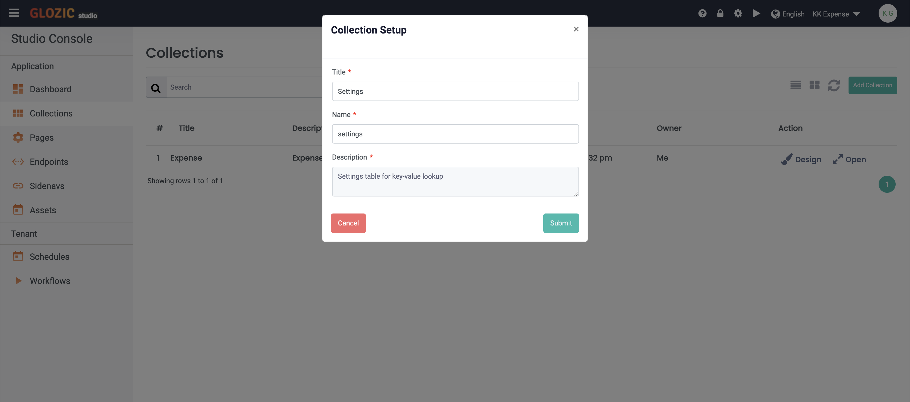

Create the following form layout and components as suggested in the below screen capture


Here is the summary of the required components

| Component Type | Component | Properties |
| -- | -- | -- |
| Layout | Div | Custom CSS Class: `w-75 mx-auto align-items-center shadow bg-light rounded p-2`|
| Form | Text Field | Label: `Name` <br/> Property Name: `name` |
| Form | Text Area | Label: `Description` <br/> Property Name: `description` |
| Data | Edit Grid | Label: `Values` <br/> Property Name: `values` |
| Form | Text Field | Label: `Label` <br/> Property Name: `label` |
| Form | Text Field | Label: `Value` <br/> Property Name: `value` |

Go to the "**View**" tab of the collection design, change the Default View to show only Name and Description columns, please refer to the below screen capture for reference.
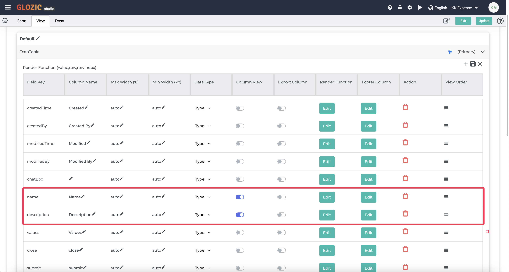

:::tip Import Form Template
Instead of creating the collection form by dragging component by component, you are allowed to create a form by importing from an exported template.

To do that, open the Form Template setting from the form icons as shown in the below screen capture
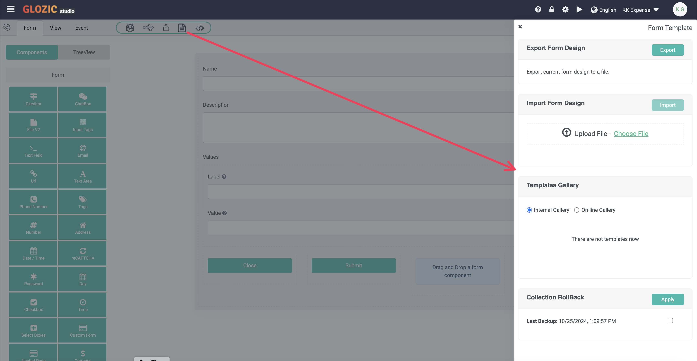

Instead of creating form manually, you may import the attached template below.

[settings.json](./assets/settings.json)
:::

## Add a document to the Settings collection

Once the Settings collection was created, proceed to add a new document to the collection, you may refer to the below suggestion of data to be created.
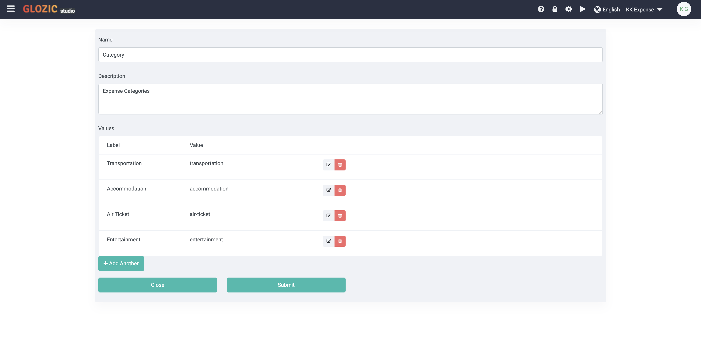

:::tip Note
You may follow the previous Tutorial to create a JSON list view for the **Settings** collection, this helps to examine the document structure that you have just created.
:::

## Form Variables

In Glozic, variables serve as temporary containers for various data types. These variables can be utilized within forms and pages to dynamically display and manipulate information.

Variables can be populated through several methods:

External Data Queries: Fetching data from external sources using web service calls.
Database Interactions: Retrieving data from collections within your Glozic application.
Data Manipulation: Transforming or combining data from existing variables.
By effectively using variables, you can create more flexible and interactive applications that respond to changing data and user inputs.

## Add a variable to the Expense form

Open Form Design of **Expense** collection that was created in the Basic Tutorial. Click the "**Connector**" icon from the Form tool icon set, click the "**Add**" button next to the Variables to create/defin new variable, as highlighted in the below screen capture.
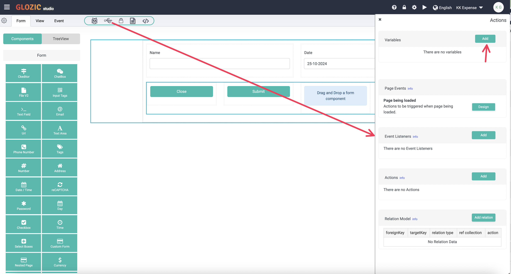

Configure the variable according suggestion as shown in the below screen capture, and click **Submit** to save the variable.


## Add Edit Grid Component for Nested Expense Items

Drag a "**Edit Grid**" component (Label : `Expense Items` and Property Name: `expenseItems`) and place it between the two **Column** components, add a "**Text Field**" component (Label: `Description`, Property Name: `description`) inside the **Edit Grid** component, this will give you something similar to the below screen capture.
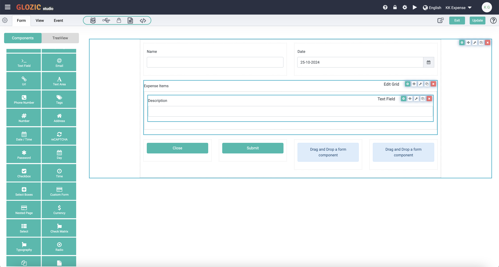

Drag a "**Select**" component (Label: `Category`, Property Name: `category`) below the **Description** text field component, follow the suggested configuration as shown in the below screen capture.
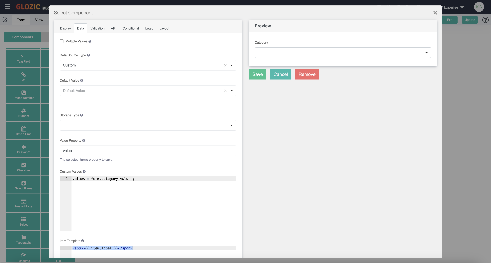

Drag a "**Currency**" component (Label: `Amount`, Property Name: `amount`) below the **Category** Select component. You should be getting something similar to the below screen capture.


Update and Exit from the Form/Collection design. Open the **Expense** collection to try creating or editing an existing Expense document. You should be seeing updated Expense Form similar to the below screen capture.
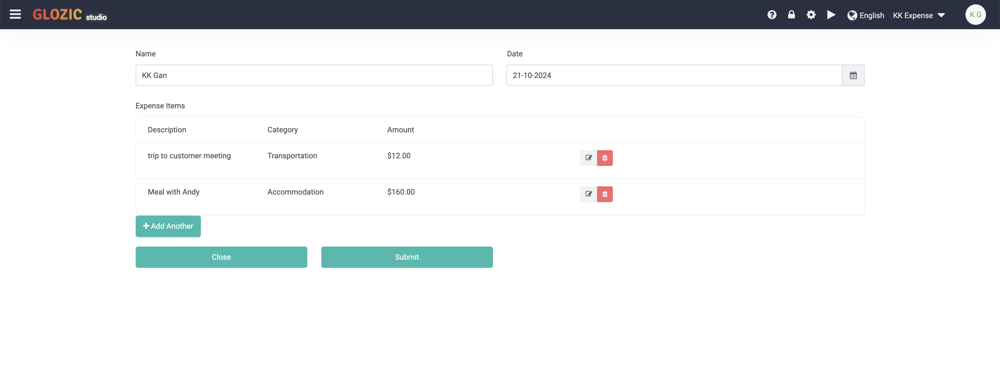

## Sum Expense Amount of Expense Items
We going to add a Total Amount field to sum the total amount of expense items. Lets add a new row to the **Column** component that is holding the **Close** and **Submit** buttons. Click the **Cog** icon of the Column component to edit the component, and add two columns as shown in the below screen capture. You may drag the added column to move it to the top as highlighted in the screen capture.
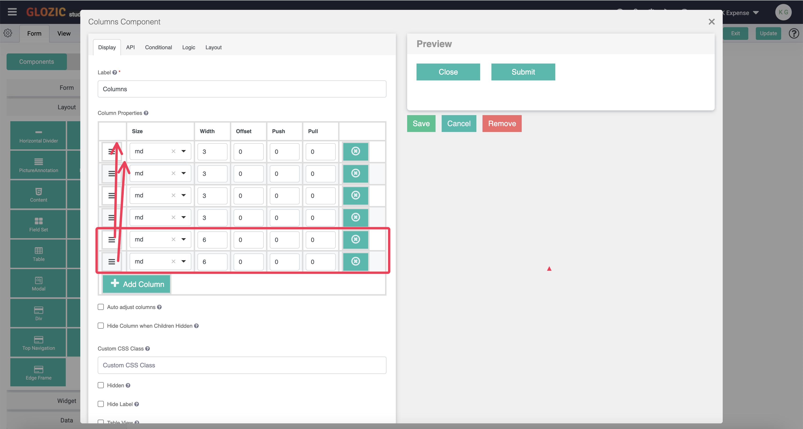

The Expense Form should look similar to the below screen capture for now, where we have added two additional columns above the **Close** and **Submit** buttons. Drag a **Currency** component onto the placeholder highlighted in the screen capture.


Set the Label of the currency component to `Total` (i.e. Property Name will be set to `total` automatically), go to the **Data** tab of the Currency component, scroll down to the **Javascript** editor under the **Calculated Value** section. Copy and paste the following Javascript code
```javascript showLineNumbers
var editGrid = data["expenseItems"] || [];
var total = 0
for (var i = 0; i <= editGrid.length; i++) {
  if (!!editGrid[i] && editGrid[i].hasOwnProperty("amount")) {
    var amt = Math.round((editGrid[i]["amount"] + Number.EPSILON) * 100) / 100;
    total = total + amt;
  }
}
value = total;
```
The Javascript code pasted in the Javascript editor as shown in the below screen capture
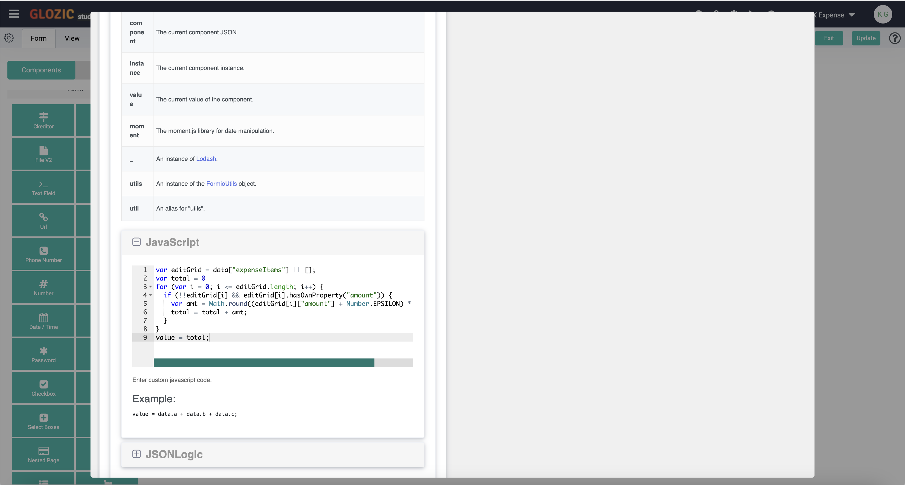

As the Data tab of the Currency components, similar to other components where the component configuration modal might be too big to see the entire configurable content, you will need to scroll the modal dialog box up and down to view all content. After you have pasted the Javascript, you will need to scrool up so the component's Save/Cancel/Remove button can be seen as shown in the below screen capture. Click the **Save** button to save the **Total** Currency component.
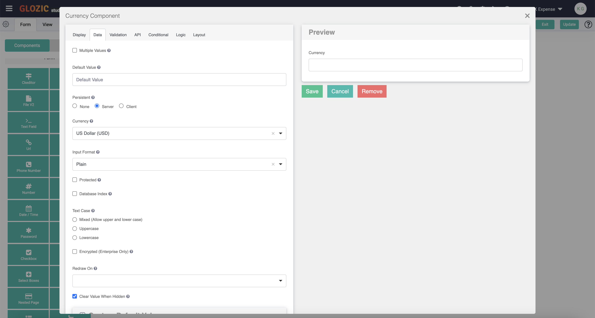

The Expense Form is now updated to something similar to the below screen capture.
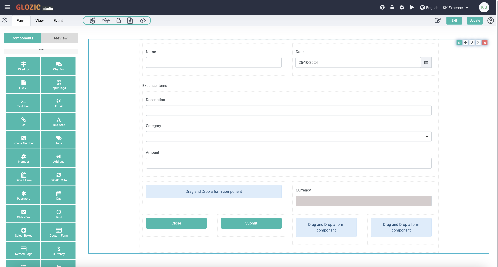
:::tip Note
Take note that I have also set the Total (i.e. Currency Component) field to `Disabled` (i.e. a property under the **Display** tab of the component). To avoid this component being edited by users.
:::

## Inspect and Change Form CSS

Try out the form you have built so far by creating a (i.e. **Expense**) document and save the document. **Open/Edit** the document, you should be getting something similer to the below screen capture
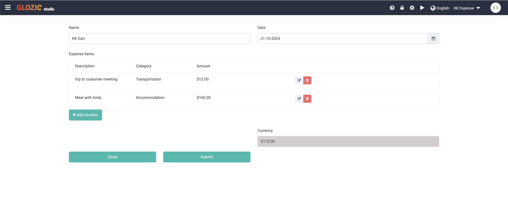

We are going to inspect and make some changes to the defaulted styling of the **Edit Gird** component. Right click on the Expense document's first column header as shown in the below screen capture.
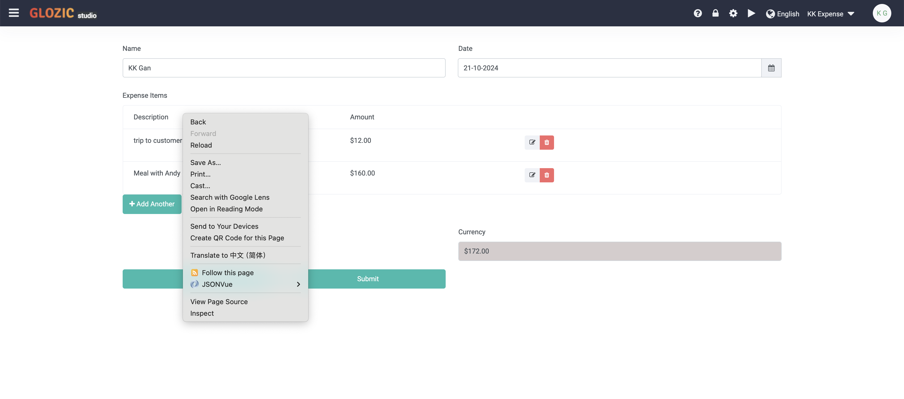

Select the **Inspect** from the pop-up menu to inspect the code. After you have found the html element for the **Edit Grid** component, try to change the `.list-group` CSS Class by adding a border as shown in the below screen capture.


This approach helps us inspect and modify the CSS to our expectation, copy the updated `.list-group` as shown in the below screen capture.
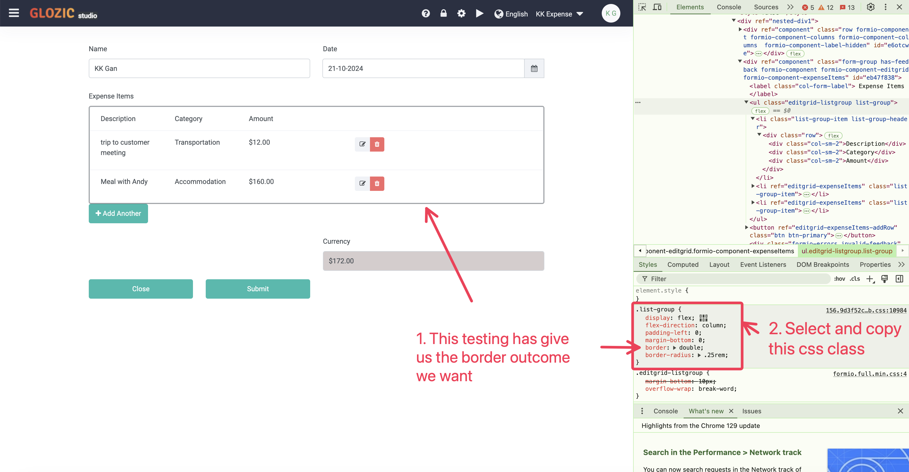

Back to Edit the **Expense** collection form, paste the copied CSS class and add it to the form as shown in the below screen capture.
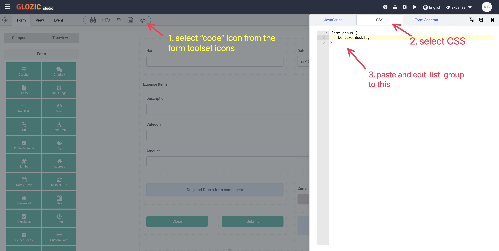

The CSS Class to be modified as below
```CSS
.list-group {
  border: double;
}
```

Try to open any Expense document to examine the result again, the Edit Grid is now formatted with the border settings as expected, shown in the below example.
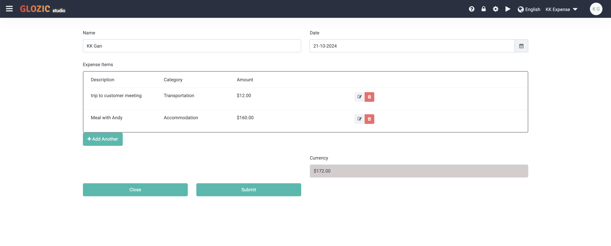