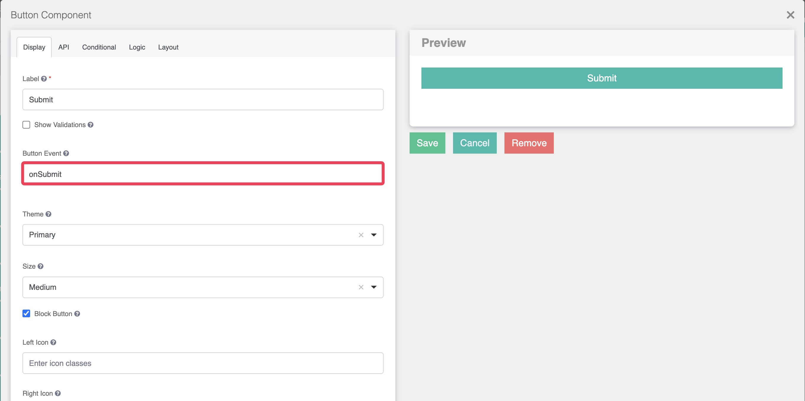
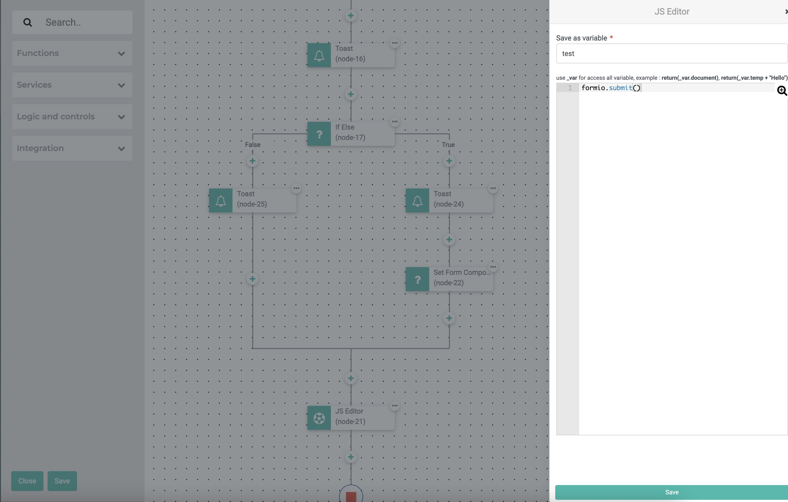

# Submit form data

Every collection accompanied with a form for user to submit or edit documents of the Collection.

Submitting form data is as simple as adding a "**Button (Submit)**" button to the form design canvas. 

In the event if you would like to perform some other actions before submitting a form, you may add a "**Button (Event)**" button instead of using the default "Submit" button.

When an "Event" button is clicked, it triggers an "action flow" supporting custom action flow to be triggered. This could be performing additional actions before the form is being submitted. 

Below screen capture demonstrates how to use the "JS Editor" action in an action flow to invoke the submit function,

